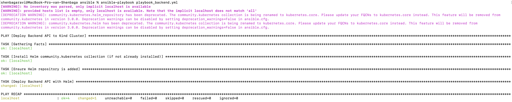
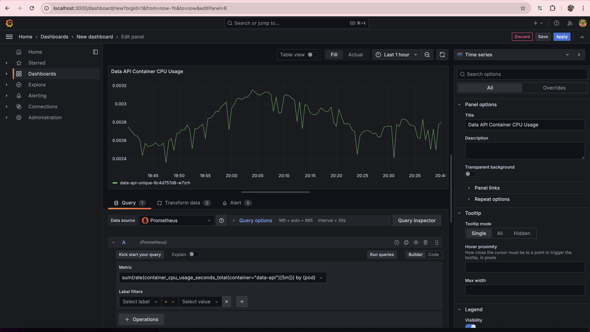
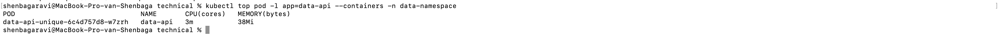

# DevOps Orchestration Assessment

This repository contains two applications, `backend_api` and `data_api`, along with a health check script. The objective is to update and deploy these applications to a Kubernetes setup, implement monitoring, and automate the deployment process using Helm and Ansible.

## 1. Backend API

The `backend_api` is a Python Flask application that serves as the main processing service in this setup. It includes several routes designed to handle tasks related to logging and interacting with an external service.

### Key Features

- **`/`**: This endpoint generates random log messages and saves them to a specified directory.
  - The API simulates processing by waiting for 3 seconds before logging the action.
  - Log messages are saved in a `/logs` directory, which is created if it does not already exist. Each log entry is stored in a uniquely named file based on the current timestamp.

- **`/download_external_logs`**: This endpoint interacts with a dummy external API that requires authentication through an integration key specific to the environment.
  - The API requires an `env` query parameter to determine which environment's integration key to use (e.g., development, staging, or production).
  - The integration keys are managed through environment variables, allowing for easy switching between different configurations.

## 2. Data API

The `data_api` is another Python Flask application designed to work alongside the `backend_api`. Its primary function is to generate logs, simulating processing tasks and providing mock data endpoints.

### Key Features

- **`/`**: This route simulates a processing task by generating a random log message and saving it to a specified directory.
  - The API waits for 3 seconds to mimic processing time before logging the action.
  - Log messages are written to files in a `/logs` directory, which is created if it does not already exist. Each log entry is stored in a uniquely named file based on the current timestamp.

## 3. Local Kubernetes Setup

To simulate the application migration, we will use a local Kubernetes cluster like Kind (Kubernetes IN Docker). Follow the steps below to install Kind using Homebrew and create a cluster:

### Install Kind

Use Homebrew to install Kind:

```
brew install kind
```

### Create a Cluster

Create a cluster named dev-cluster:

```
kind create cluster --name dev-cluster
```

### List Available Clusters

Confirm the cluster's creation by listing all available clusters:

```
kind get clusters
```


### Install kubectl

Install kubectl via Homebrew:

```
brew install kubectl
```

### Verify the Cluster

Check the nodes in the cluster:

```
kubectl get nodes
```


## 4. Creating Dockerfile and Building Images
For both the backend_api and data_api, we wrote Dockerfiles to containerize the applications. After building the Docker images, we tagged them appropriately.

Steps:
Write Dockerfile
We created Dockerfiles for both backend_api and data_api to define their dependencies and runtime configurations.

#### Build Docker Images
Use the following command to build each Docker image and tag it:

```
docker build -t backend-api:v1 .

docker build -t data-api:v1 .
```
Push to Cloud Repository (Optional)
If using AWS or Azure, we could push these images to ECR (AWS) or ACR (Azure) to manage and deploy the images at scale.


## 5. Helm Chart Setup for backend_api and data_api

To deploy backend_api and data_api applications on Kubernetes, we created separate Helm charts, each containing the necessary configurations for deployments and services.

#### Helm Chart for backend_api - helm

- Chart.yaml: Defines the chart metadata, such as name (assessment), description, and version.
- Values.yaml: Contains default values for the backend_api deployment, including:
- image: Docker image for backend_api (e.g., backend-api:v1).
- env: Environment variables, such as the EXTERNAL_INTEGRATION_KEY.
- port: Application port (5000).
- Templates:
  deployment-backend.yaml: Defines the deployment configuration for backend_api, including the number of replicas, environment variables, and container port.
  service-backend.yaml: Defines the service configuration to expose backend_api within the Kubernetes cluster on port 80.

#### Best Practice: Since this implementation uses a dummy URL, sensitive environment variables are not managed with Kubernetes Secrets. However, in a production scenario, consider using Kubernetes Secrets to store sensitive information securely. If using Secrets, ensure to modify your deployment configuration to reference the appropriate Secret for your environment variables.

#### Helm Chart for data_api - helm-data
- Chart.yaml: Defines chart metadata for data_api, similar to backend_api.
- Values.yaml: Contains values specific to data_api, such as:
- image: Docker image for data_api (e.g., data-api:v1).
- port: Application port (5000).
- Templates:
  deployment-data.yaml: Defines the deployment configuration for data_api.
  service-data.yaml: Defines the service configuration to expose data_api on port 80 within the Kubernetes cluster.

Both Helm charts allow for easy management and deployment customization for each application, enabling a seamless integration with Kubernetes.

## 6. Deployment via Ansible

To automate the deployment of backend_api and data_api applications on the Kubernetes cluster, we used Ansible playbooks. These playbooks deploy each application using Helm, allowing for efficient and repeatable deployments.

#### Ansible Files Structure
- inventory.yml: Defines the inventory with a localhost entry, specifying that Ansible should run locally with ansible_connection: local.
- group_vars/all.yml: Stores reusable variables for deployment:
- release_backend and namespace_backend: Specifies the Helm release name and Kubernetes namespace for backend_api.
- release_data and namespace_data: Specifies the Helm release name and Kubernetes namespace for data_api.

#### Playbooks

#### playbook_backend.yml: Automates the deployment of backend_api.

Installs Helm collection: Ensures the community.kubernetes collection is installed.
Adds Helm repository: Ensures that the Helm repository is available.

Deploys backend: Uses Helm to deploy backend_api from the specified chart path (../helm) into backend-namespace.
```

```

#### playbook_data.yml: Automates the deployment of data_api.

Installs Helm collection: Ensures the community.kubernetes collection is installed.
Adds Helm repository: Ensures that the Helm repository is available.
Deploys data API: Uses Helm to deploy data_api from the specified chart path (../helm-data) into data-namespace.
```

```
This Ansible setup streamlines the process of deploying both applications to Kubernetes, with each playbook responsible for a single API. The configuration is designed to be adaptable, allowing for changes to namespaces or Helm release names through the group_vars/all.yml file.

## 7. Verifying Deployments and Capturing Screenshots

#### Check the Pods in Kind Cluster Namespaces
Run the following command to list the pods in each namespace:

```
kubectl get pods -n backend-namespace
kubectl get pods -n data-namespace


```

#### Port Forward and Logs in Browser
Forward the backend API port to access the log messages from your browser:

kubectl port-forward svc/backend-api-service-unique 5000:80 -n backend-namespace
```


```
Then open your browser and navigate to http://localhost:5000 to see the log output. 
```


```

#### Different Routes for Backend API

The backend API has two main routes:

- Root Route (/): This route generates and logs random messages. You should see log entries when you access this endpoint.

- Download External Logs Route (/download_external_logs): This route attempts to interact with an external API. If you do not specify a valid environment, you will receive an error message indicating "Invalid environment".
```

```
- If you specify an environment but use a dummy URL, you will get an error response similar to:
```

```
Since this is a dummy URL with dummy integration keys, no successful connection can be established.

#### Repeat for Data API

Similarly, set up port forwarding for the data API service:

kubectl port-forward svc/data-api-service-unique 5001:80 -n data-namespace
```

```
Visit http://localhost:5001 in the browser and take a screenshot of the log output.

```

```

Once these steps are done, you’ll have a complete set of visuals showing successful deployments and API functionality.

## 8. Monitoring Kubernetes Applications
In this section, we configured Prometheus and Grafana to monitor the resource utilization of nodes, pods, and containers in our Kubernetes cluster.

#### Kube-Prometheus Stack
The Kube-Prometheus stack is a collection of Kubernetes manifests, Grafana dashboards, and Prometheus rules, providing an easy way to operate an end-to-end Kubernetes cluster monitoring solution with Prometheus using the Prometheus Operator.

#### Steps to Install Prometheus:
- Add Helm Repositories:

```
helm repo add prometheus-community https://prometheus-community.github.io/helm-charts
helm repo add stable https://charts.helm.sh/stable
helm repo update
```
- Create a Namespace for Monitoring:

```
kubectl create namespace monitoring
```

- Install the Kube-Prometheus Stack:

```
helm install kind-prometheus prometheus-community/kube-prometheus-stack --namespace monitoring --set prometheus.service.nodePort=30000 --set prometheus.service.type=NodePort --set grafana.service.nodePort=31000 --set grafana.service.type=NodePort --set alertmanager.service.nodePort=32000 --set alertmanager.service.type=NodePort --set prometheus-node-exporter.service.nodePort=32001 --set prometheus-node-exporter.service.type=NodePort
```
```

```

- Validate the Installation:

- Check the status of the installed components:
```
kubectl --namespace monitoring get pods -l release=kind-prometheus
```
```

```
- Get all resources in the monitoring namespace:
```
kubectl get all --namespace monitoring
```
```

```

- Access Dashboards:

Prometheus: http://<nodeIP>:30000/graph
AlertManager: http://<nodeIP>:32000/graph
Grafana: http://<nodeIP>:31000/

- Credentials for Grafana:

```
User: admin
Password: prom-operator
```

```

```
```

```

#### Grafana rules you can set up to monitor resource utilization:

Monitoring Backend and Data API Container Resource Utilization

- Backend API Container CPU Usage
To monitor the CPU usage of the backend API container, use the following query:

sum(rate(container_cpu_usage_seconds_total{container="backend-api"}[5m])) by (pod)


- Backend API Container Memory Usage
For memory usage of the backend API container, use:


sum(container_memory_usage_bytes{container="backend-api"}) by (pod)


- Data API Container CPU Usage
To monitor the CPU usage of the data API container, use the following query:


sum(rate(container_cpu_usage_seconds_total{container="data-api"}[5m])) by (pod)



- Data API Container Memory Usage
For memory usage of the data API container, use:


sum(container_memory_usage_bytes{container="data-api"}) by (pod)


- Node CPU Usage

Query: sum(rate(container_cpu_usage_seconds_total[5m])) by (node)


- Node Memory Usage

Query: sum(container_memory_usage_bytes) by (node)


- Pod CPU Usage

Query: sum(rate(container_cpu_usage_seconds_total[5m])) by (pod)


- Pod Memory Usage

Query: sum(container_memory_usage_bytes) by (pod)


- Container Disk I/O

Query: sum(rate(container_fs_reads_bytes_total[5m])) by (container)


#### Configuring Metrics Server
In addition to Prometheus, we also configured the Metrics Server in our Kind cluster to obtain quick and straightforward insights into resource usage. This enables us to use commands like kubectl top for monitoring resources.

Steps to Install Metrics Server:
- Add the Metrics Server Helm Repository:

```
helm repo add metrics-server https://kubernetes-sigs.github.io/metrics-server/
helm repo update
```

- Install Metrics Server:

```
helm upgrade --install --set args={--kubelet-insecure-tls} metrics-server metrics-server/metrics-server --namespace kube-system


```

Useful Commands for Metrics Server:
- Check node resource utilization:

```
kubectl top nodes


```
- Check pod resource utilization:

```
kubectl top pods --all-namespaces

```
- Check container resource utilization:

```
kubectl top pod <pod_name> -n <namespace>


```

Using the Metrics Server alongside Prometheus provides a comprehensive view of your Kubernetes cluster's performance and resource usage.

## 8.Monitoring Resource Utilization for Specific Pods using labels 

To monitor resource utilization specifically for our backend and data API containers in Grafana, you can use label filters on metrics. This allows us to isolate metrics for particular containers within Pods.

#### Grafana Queries
Backend API Container Utilization

- CPU Usage:

Metric: container_cpu_usage_seconds_total
Label Filters: container="backend-api"


Data API Container Utilization

- CPU Usage:

Metric: container_cpu_usage_seconds_total
Label Filters: container="data-api"


#### Metrics Server Commands
To quickly check resource usage for these containers from the command line using kubectl top, filter by namespace and Pod name:

Get CPU and Memory Usage for All Containers in Pods with a Specific Label:

- Backend API Container:


kubectl top pod -l app=backend-api --containers -n backend-namespace


Replace app=backend-api or app=data-api with the actual labels you’ve applied to your pods.

The --containers flag will show CPU and memory usage at the container level within each pod.

- Data API Container:

kubectl top pod -l app=data-api --containers -n data-namespace




## 9. Health Check Implementation

In addition to the backend and data APIs, we created a health check implementation to monitor the availability and functionality of these services within the Kubernetes cluster.

#### Health Check Files

The following files are included in the health-check directory:

- Dockerfile: This file defines the Docker image for the health check service. It includes the necessary dependencies and configurations to run the health check script.

- health-check-script.sh: This shell script contains the logic for performing health checks against the backend and data APIs. It logs the results of these checks to a specified log file. The script uses curl to send HTTP requests to the APIs and checks for expected HTTP response codes.

- health-check-cronjob.yaml: This file defines a Kubernetes CronJob that runs the health check script at specified intervals, ensuring that service availability is regularly monitored.

- health-check-pv.yaml: This file describes a Persistent Volume (PV) that provides storage for the health check logs, ensuring that logs persist even if the pod is restarted.

- health-check-pvc.yaml: This file defines a Persistent Volume Claim (PVC) that requests storage from the PV defined in health-check-pv.yaml. The PVC allows the health check pod to store its log files in a persistent manner.

#### How Logs are Stored

The logs generated by the health check script are stored in the Persistent Volume (PV) defined in health-check-pv.yaml. The PV is then accessed via the Persistent Volume Claim (PVC) defined in health-check-pvc.yaml, ensuring that the logs persist even if the health check pod is restarted.

#### Service URLs and Namespaces
The health check script accesses the backend and data APIs using their respective service URLs, which include the service names and the namespaces in which they are deployed:

- Backend API: http://backend-api-service-unique.backend-namespace/
- Data API: http://data-api-service-unique.data-namespace/
This allows the health check to monitor the correct endpoints within the Kubernetes environment.

#### Accessing Logs
To access the logs generated by the health check, you can follow these steps:

- Create the Kubernetes resources using the following commands:

```
kubectl apply -f health-check-pv.yaml
kubectl apply -f health-check-pvc.yaml
kubectl apply -f health-check-cronjob.yaml
```

- Check the status of the CronJob to ensure it has been created:

```
kubectl get cronjob -n health-namespace

```

- Check the logs from the health check script using a dedicated log pod. First, create a pod to access the logs:

```
kubectl run log-access --image=alpine --restart=Never -n health-namespace -- /bin/sh -c "sleep 3600"
```
- Access the logs stored in the PVC:

In the screenshot below, you can see that the health checks for both the backend and data APIs passed successfully. However, the health check for the "Download External Logs" endpoint of the backend failed because we used a dummy endpoint for that check.
```
- kubectl exec -it log-access -n health-namespace -- cat /var/log/health_check.log


```
- Delete the log access pod after you have retrieved the logs:

```
kubectl delete pod log-access -n health-namespace
```
This process allows you to effectively monitor the health of your services and retrieve logs for further analysis.

## Conclusion

We updated the backend Python code and deployed two applications and a health check script to Kubernetes. The health check script now monitors the backend API calls. We used Prometheus, Grafana, and Metrics Server for monitoring, and deployed everything with Helm and Ansible.

## Submission Details

#### The repository includes:

- Screenshots of successful API calls and resource utilization monitoring.
- Detailed Documentation on setup, commands, and configurations.
- README file with descriptions of each component and task.
